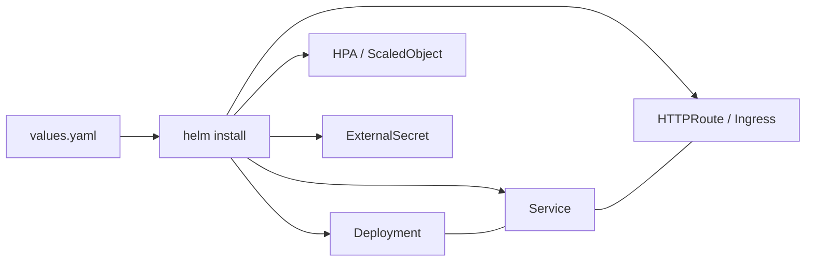

# universal-helm-chart

[](https://github.com/purisev/universal-helm-chart/releases)
[](https://helm.sh)
[](LICENSE)

A single Helm chart that replaces per-application charts in Kubernetes / ArgoCD stacks.
Define any number of Deployments, StatefulSets, CronJobs, routes, autoscalers, and lifecycle jobs — all from one values file.

## Features

| Category | Resources |
|---|---|
| **Workloads** | Deployments (map), StatefulSets (map), CronJobs (map) |
| **Networking** | Service (auto-created per workload), Ingress (singleton + map) |
| **Gateway API** | HTTPRoute, GRPCRoute, TLSRoute (singleton + map + per-workload merge), ReferenceGrant |
| **Autoscaling** | HPA (`autoscaling/v2`), KEDA ScaledObjects, VPA |
| **Availability** | PodDisruptionBudget |
| **Secrets** | ExternalSecrets Operator (ESO) — SecretStore, ClusterSecretStore, ExternalSecret |
| **Config** | ConfigMaps (chart-level with auto-mount + per-workload), envFrom injection |
| **ArgoCD hooks** | dbJob (wave 2), initJob (wave 3), postSync (PostSync hook) |
| **Identity** | ServiceAccount, RBAC (Role + RoleBinding) |
| **Observability** | VictoriaMetrics VMServiceScrape, Stakater Reloader |
| **Image automation** | ArgoCD Image Updater CRD (ImageUpdater) |
| **Security** | Non-root defaults, read-only filesystem, seccomp RuntimeDefault, caps dropped |

## How it works



## Quick start

```yaml
# values.yaml
image:
  repository: myregistry/myapp
  tag: "1.0.0"

httpRoute:
  parentRefs:
    - name: my-gateway
      namespace: gateway-system
  hostnames:
    - app.example.com

deployments:
  web:
    enabled: true
    replicaCount: 2
    service:
      enabled: true
      port: 80
      targetPort: 8080
    httpRoute:
      enabled: true
      priority: 10
      rules:
        - matches:
            - path:
                type: PathPrefix
                value: /
    resources:
      requests:
        cpu: 100m
        memory: 128Mi
      limits:
        memory: 256Mi
```

```bash
helm install my-app oci://ghcr.io/purisev/universal-helm-chart --version 1.1.0 \
  --values values.yaml

# Dry-run
helm template my-app oci://ghcr.io/purisev/universal-helm-chart --version 1.1.0 \
  --values values.yaml
```

## Installation

```bash
# From OCI registry
helm install my-app oci://ghcr.io/purisev/universal-helm-chart --version 1.1.0 --values values.yaml

# From local checkout
git clone https://github.com/purisev/universal-helm-chart
helm install my-app ./universal-helm-chart --values values.yaml
```

## Requirements

| Requirement | Version | Notes |
|---|---|---|
| Kubernetes | ≥ 1.27 | Required for `timeZone` in CronJobs |
| Helm | ≥ 3.0 | — |
| Gateway API CRDs | ≥ 1.0 | Only if using HTTPRoute / GRPCRoute / TLSRoute |
| ESO Operator | ≥ 0.9 | Only if using ExternalSecrets / SecretStores |
| KEDA | ≥ 2.0 | Only if using `keda.enabled: true` |
| VPA | any | Only if using `verticalPodAutoscaler.enabled: true` |
| ArgoCD | ≥ 2.0 | Only if using lifecycle jobs and sync waves |
| VictoriaMetrics Operator | any | Only if using `metrics.enabled: true` |
| Stakater Reloader | any | Only if using `reloader.enabled: true` |

## Documentation

| Doc | Contents |
|---|---|
| [Architecture](docs/architecture.md) | Template map, naming conventions, helper reference, security defaults |
| [Workloads](docs/workloads.md) | Deployments, StatefulSets, CronJobs, Services, sidecars, scheduling |
| [Environment Variables](docs/environment-variables.md) | 4-layer merge, inherit flags, envFrom, envDev/envProd |
| [Ingress & Gateway API](docs/ingress-and-gateway.md) | Ingress, HTTPRoute, GRPCRoute, TLSRoute, ReferenceGrant |
| [Secrets & Config](docs/secrets-and-config.md) | ConfigMaps, auto-mount, ExternalSecrets Operator |
| [ArgoCD Integration](docs/argocd-integration.md) | Sync waves, dbJob, initJob, postSync, Image Updater |
| [Autoscaling](docs/autoscaling.md) | HPA, KEDA, VPA, PodDisruptionBudget |
| [Operations](docs/operations.md) | RBAC, NetworkPolicy, VMServiceScrape, troubleshooting |
| [Values Reference](docs/values-reference.md) | All top-level values grouped by concern |

## License

Apache-2.0 — see [LICENSE](LICENSE).
