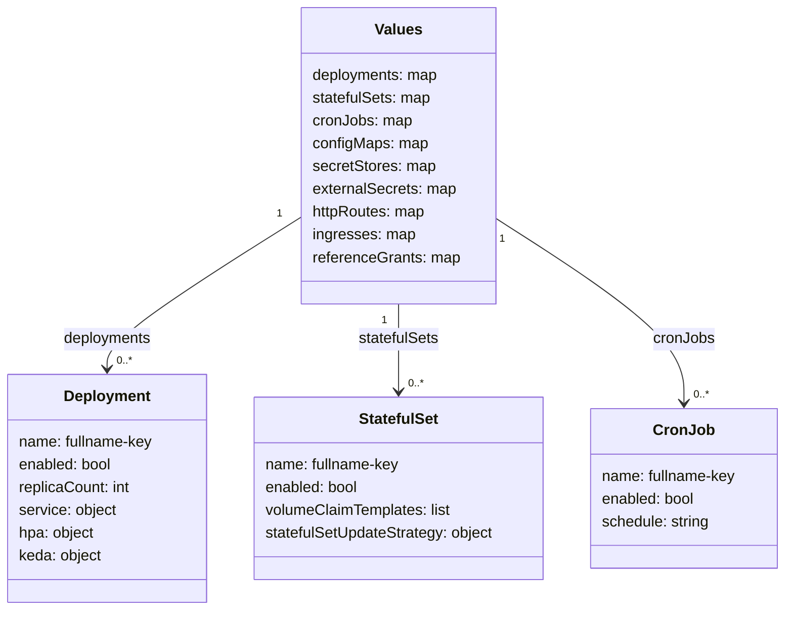

# Architecture

## Template map

| Template | Kubernetes resource | Notes |
|---|---|---|
| `deployment.yaml` | `Deployment` | One per `deployments.<key>` |
| `statefulset.yaml` | `StatefulSet` | One per `statefulSets.<key>` |
| `cronjob.yaml` | `CronJob` | One per `cronJobs.<key>` |
| `service.yaml` | `Service` | One per enabled workload; headless for StatefulSets |
| `ingress.yaml` | `Ingress` | Singleton + one per `ingresses.<key>` |
| `httproute.yaml` | `HTTPRoute` | Singleton (merged from workloads) + one per `httpRoutes.<key>` |
| `grpcroute.yaml` | `GRPCRoute` | Singleton (merged from workloads) + one per `grpcRoutes.<key>` |
| `tlsroute.yaml` | `TLSRoute` | Singleton (merged from workloads) + one per `tlsRoutes.<key>` |
| `referencegrant.yaml` | `ReferenceGrant` | Singleton + one per `referenceGrants.<key>` |
| `configmap.yaml` | `ConfigMap` | Per-workload + chart-level (`configMaps.<key>`) |
| `job-init.yaml` | `Job` | ArgoCD Sync hook (wave 3) |
| `job-db.yaml` | `Job` | ArgoCD Sync hook (wave 2) |
| `job-postsync.yaml` | `Job` | ArgoCD PostSync hook; one Job per `postSync.jobs.<key>` |
| `hpa.yaml` | `HorizontalPodAutoscaler` | Per Deployment; skipped when KEDA is enabled |
| `scaledobject.yaml` | `ScaledObject` | Per workload with `keda.enabled: true` |
| `verticalpodautoscaler.yaml` | `VerticalPodAutoscaler` | Per workload with `verticalPodAutoscaler.enabled: true` |
| `poddisruptionbudget.yaml` | `PodDisruptionBudget` | Per workload with `podDisruptionBudget.enabled: true` |
| `networkpolicy.yaml` | `NetworkPolicy` | Per workload with `networkPolicy.enabled: true` |
| `vmservicescrape.yaml` | `VMServiceScrape` | Per workload with `metrics.enabled: true` |
| `secretstore.yaml` | `SecretStore` / `ClusterSecretStore` | One per `secretStores.<key>` |
| `externalsecret.yaml` | `ExternalSecret` | One per `externalSecrets.<key>` |
| `serviceaccount.yaml` | `ServiceAccount` | Conditional on `serviceAccount.create: true` |
| `rbac.yaml` | `Role` + `RoleBinding` | Conditional on `rbac.enabled: true` |
| `imageupdater.yaml` | `ImageUpdater` | Conditional on `imageUpdater.enabled: true` |
| `_helpers.tpl` | — | Shared named templates (no K8s output) |
| `validate.yaml` | — | Fail-fast validation (no K8s output) |

## Map-based workload pattern

All workload collections are YAML maps keyed by name. Templates iterate them with `keys | sortAlpha` to guarantee deterministic resource ordering across renders.

## Naming conventions

| Resource | Name pattern |
|---|---|
| Deployment | `<fullname>-<key>` |
| StatefulSet | `<fullname>-<key>` |
| Service (Deployment) | `<fullname>-<key>` |
| Service (StatefulSet, headless) | `<fullname>-<key>` with `clusterIP: None` |
| HPA / ScaledObject / VPA / PDB | `<fullname>-<key>` |
| ConfigMap (chart-level) | `<fullname>-<key>` |
| ConfigMap volume name | `cm-<key>` |
| Ingress (multi-map) | `<fullname>-<key>` |
| HTTPRoute / GRPCRoute / TLSRoute (multi-map) | `<fullname>-<key>` |
| HTTPRoute / GRPCRoute / TLSRoute (singleton) | `<fullname>` |
| ReferenceGrant (multi-map) | `<fullname>-<key>` |
| ExternalSecret | `<fullname>-<key>` |
| Job (init) | `<fullname>-init` |
| Job (db) | `<fullname>-db` |
| Job (postSync) | `<fullname>-<key>` |

`<fullname>` = `<release-name>-<chart-name>` truncated to 63 characters, or `fullnameOverride` if set.

## Helper template reference

All helpers are defined in `templates/_helpers.tpl` and prefixed with `uhc.`.

| Helper | Purpose |
|---|---|
| `uhc.name` | Chart name, truncated to 63 chars |
| `uhc.fullname` | Release-qualified name (truncated, or `fullnameOverride`) |
| `uhc.chart` | `name-version` string for `helm.sh/chart` label |
| `uhc.labels` | Standard chart-level labels (chart, instance, managed-by) |
| `uhc.workloadLabels` | Per-workload labels including `app.kubernetes.io/instance: fullname-key` |
| `uhc.workloadSelectorLabels` | `matchLabels` used by Services, PDBs, HPAs, VMServiceScrapes |
| `uhc.initJobLabels` | Labels for the init Job |
| `uhc.dbJobLabels` | Labels for the DB Job |
| `uhc.postSyncLabels` | Labels for postSync Jobs |
| `uhc.serviceAccountName` | Resolved ServiceAccount name |
| `uhc.envVars` | 4-layer env merge — see [Environment Variables](environment-variables.md) |
| `uhc.envFrom` | `envFrom:` block merging root + workload secrets and configmaps |
| `uhc.containerSpecWithOptions` | Full container spec with image, env, probes, mounts |
| `uhc.containerSpec` | Thin wrapper around `uhc.containerSpecWithOptions` for main containers |
| `uhc.sidecarsSpec` | Renders sidecars map (sorted); inherits parent `inherit` settings |
| `uhc.podSpec` | Pod-level: imagePullSecrets, serviceAccountName, securityContext, hostAliases |
| `uhc.scheduling` | nodeSelector, affinity, tolerations, topologySpreadConstraints |
| `uhc.configMapAutoVolumes` | Generates volumes for `configMaps` entries that have `mountPath` set |
| `uhc.esoApiVersion` | Detects ESO API version via `.Capabilities`; falls back to `v1beta1` |

## Security defaults

All workloads (Deployments, StatefulSets, CronJobs, Jobs) ship with secure-by-default settings that meet Kubernetes Pod Security Standards **Restricted** level.

| Field | Default | Scope |
|---|---|---|
| `podSecurityContext.runAsNonRoot` | `true` | All pods |
| `podSecurityContext.runAsUser` | `1000` | All pods |
| `podSecurityContext.runAsGroup` | `1000` | All pods |
| `podSecurityContext.fsGroup` | `1000` | All pods |
| `podSecurityContext.seccompProfile.type` | `RuntimeDefault` | All pods |
| `securityContext.allowPrivilegeEscalation` | `false` | All containers |
| `securityContext.readOnlyRootFilesystem` | `true` | All containers |
| `securityContext.capabilities.drop` | `["ALL"]` | All containers |
| `automountServiceAccountToken` | `false` | All pods |
| `configMaps[*].readOnly` | `true` | ConfigMap volume mounts |
| `image.pullPolicy` | `IfNotPresent` | All containers |
| `revisionHistoryLimit` | `10` | Deployments, StatefulSets |
| `progressDeadlineSeconds` | `600` | Deployments |

Override per-workload by setting the same key inside `deployments.<name>` or `statefulSets.<name>`.
