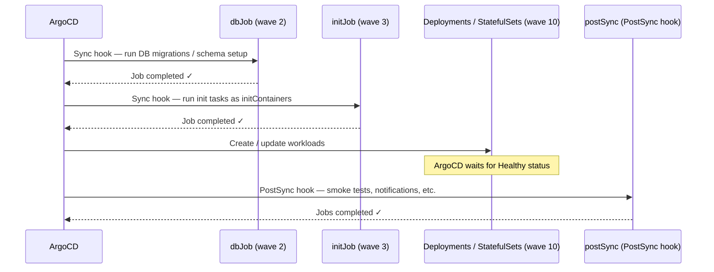
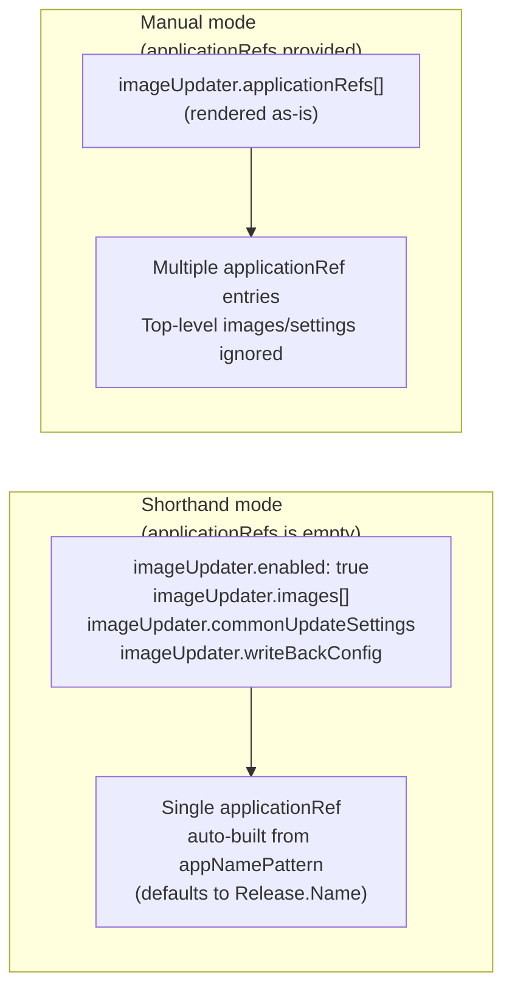

# ArgoCD Integration

## Sync wave ordering

The chart uses ArgoCD sync waves to guarantee the correct deployment order.



Wave numbers are configurable:

```yaml
syncWaves:
  databaseJobsSyncWave: "2"   # dbJob
  jobsSyncWave: "3"           # initJob
  deploymentSyncWave: "10"    # Deployments, StatefulSets, HPA, KEDA, VMServiceScrape
```

---

## dbJob — database migration job

Runs before application workloads (sync wave 2). Uses a **separate image** from the main application — typically a migration tool.

Tasks execute as `initContainers` in alphabetical key order, guaranteeing sequential execution.

```yaml
dbJob:
  enabled: true
  image:
    repository: flyway/flyway
    tag: "10"
    pullPolicy: IfNotPresent
  backoffLimit: 3
  activeDeadlineSeconds: 300    # abort if migration exceeds 5 minutes
  ttlSecondsAfterFinished: 3600
  completionImage: alpine:3.21  # signals job success to Kubernetes
  tasks:
    01-migrate:
      enabled: true
      command: |
        flyway migrate -url=jdbc:postgresql://db:5432/mydb
    02-seed:
      enabled: true
      command: |
        flyway -locations=filesystem:/seeds migrate
```

| Field | Default | Description |
|---|---|---|
| `image` | — | Separate image for migration container (required when enabled) |
| `imagePullSecrets` | root value | Override pull secrets for migration image |
| `backoffLimit` | `3` | Max retries before marking job as failed |
| `activeDeadlineSeconds` | `null` | Abort if job exceeds this duration (seconds) |
| `ttlSecondsAfterFinished` | `3600` | Auto-delete completed job after this many seconds |
| `completionImage` | `alpine:3.21` | Lightweight image for the completion signal container |
| `tasks` | `{}` | Map of initContainer tasks (executed in alphabetical order) |
| `env` | `{}` | Extra env vars for all task containers |
| `metadataAnnotations` | `{}` | Extra annotations on the Job resource |

---

## initJob — application init job

Runs after dbJob but before workload Deployments (sync wave 3). Uses the **root application image** — no separate image needed.

```yaml
initJob:
  enabled: true
  backoffLimit: 3
  ttlSecondsAfterFinished: 3600
  tasks:
    warm-cache:
      enabled: true
      command: |
        python manage.py warm_cache
    send-startup-event:
      enabled: true
      command: |
        curl -sS -X POST https://hooks.example.com/deploy-started
  env:
    DJANGO_SETTINGS_MODULE:
      value: myapp.settings.production
```

Volume mounts for init job tasks use the `volumeMounts.initJob` key:

```yaml
volumeMounts:
  initJob:
    - name: app-config
      mountPath: /etc/app
```

---

## postSync — post-deployment jobs

Runs after ArgoCD marks the sync as successful (PostSync hook). Each key under `postSync.jobs` becomes a **separate Job resource** — they run in parallel.

```yaml
postSync:
  enabled: true
  syncWave: "0"
  backoffLimit: 1
  hookDeletePolicy: HookSucceeded
  ttlSecondsAfterFinished: 600
  jobs:
    notify-slack:
      enabled: true
      image:
        repository: curlimages/curl
        tag: latest
      command: |
        curl -sS -X POST -H 'Content-type: application/json' \
          --data '{"text":"Deploy succeeded"}' \
          https://hooks.slack.com/services/...
    smoke-test:
      enabled: true
      image:
        repository: alpine
        tag: "3"
      command: |
        wget -q -O- http://my-release-web:80/health || exit 1
```

| Field | Default | Description |
|---|---|---|
| `syncWave` | `"0"` | ArgoCD sync wave for the PostSync hook |
| `backoffLimit` | `1` | Max retries per job |
| `hookDeletePolicy` | `HookSucceeded` | `HookSucceeded` \| `BeforeHookCreation` \| `HookFailed` |
| `ttlSecondsAfterFinished` | `600` | Fallback cleanup for non-ArgoCD environments |
| `jobs` | `{}` | Map of jobs; each becomes a separate Job resource |

---

## ArgoCD Image Updater

Creates an `ImageUpdater` CRD that monitors ArgoCD Applications and automatically updates image tags.

Two modes are available:



### Shorthand mode example

```yaml
imageUpdater:
  enabled: true
  namespace: argocd         # namespace where the ImageUpdater CR is created

  commonUpdateSettings:
    updateStrategy: semver

  writeBackConfig:
    method: git
    gitConfig:
      repository: git@github.com:myorg/config.git
      branch: main
      writeBackTarget: "helmvalues:/values.yaml"

  images:
    - alias: app
      imageName: myregistry/myapp
      manifestTargets:
        helm:
          name: image.repository
          tag: image.tag
```

### Manual mode example

```yaml
imageUpdater:
  enabled: true
  namespace: argocd
  applicationRefs:
    - namePattern: "my-app-*"
      commonUpdateSettings:
        updateStrategy: semver
      writeBackConfig:
        method: argocd
      images:
        - alias: app
          imageName: myregistry/myapp
```

---

## Stakater Reloader

When `reloader.enabled: true` (the default), all Deployments and StatefulSets are annotated with:

```yaml
reloader.stakater.com/auto: "true"
```

This causes [Stakater Reloader](https://github.com/stakater/Reloader) to automatically restart the workload whenever a referenced ConfigMap or Secret changes.

Disable globally:
```yaml
reloader:
  enabled: false
```

> Stakater Reloader must be installed in the cluster independently.
