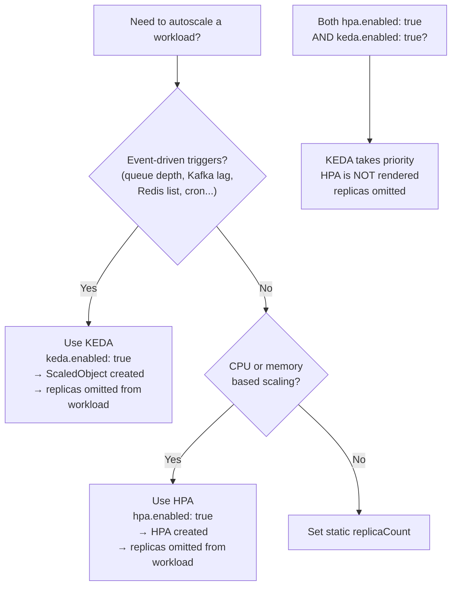

# Autoscaling

## Choosing an autoscaler



---

## HPA — HorizontalPodAutoscaler

Uses `autoscaling/v2`. Supported for **Deployments** only (use KEDA for StatefulSets).

```yaml
deployments:
  web:
    enabled: true
    hpa:
      enabled: true
      minReplicas: 2
      maxReplicas: 10          # required when hpa.enabled: true
      metrics:
        - type: Resource
          resource:
            name: cpu
            target:
              type: Utilization
              averageUtilization: 70
      behavior:
        scaleDown:
          stabilizationWindowSeconds: 300
```

| Field | Default | Description |
|---|---|---|
| `hpa.enabled` | `false` | Enable HPA |
| `hpa.minReplicas` | `1` | Minimum replica count |
| `hpa.maxReplicas` | — | **Required**; maximum replica count |
| `hpa.metrics` | — | Scaling metrics (CPU, memory, custom, external) |
| `hpa.behavior` | — | Scale-up / scale-down behavior policies |

---

## KEDA — ScaledObject

Supported for both **Deployments** and **StatefulSets**. When KEDA is enabled, `replicas` is omitted from the workload spec (KEDA manages it).

```yaml
deployments:
  worker:
    enabled: true
    keda:
      enabled: true
      minReplicas: 1
      maxReplicas: 20          # required when keda.enabled: true
      pollingInterval: 30
      cooldownPeriod: 120
      triggers:
        - type: kafka
          metadata:
            bootstrapServersFromEnv: KAFKA_BOOTSTRAP_SERVERS
            consumerGroupFromEnv: KAFKA_CONSUMER_GROUP_ID
            topicFromEnv: KAFKA_TOPIC
            lagThreshold: "100"
            sasl: scram_sha512
            tls: enable
          authenticationRef:
            name: kafka-trigger-auth
```

| Field | Default | Description |
|---|---|---|
| `keda.enabled` | `false` | Enable KEDA ScaledObject |
| `keda.minReplicas` | `1` | Minimum replica count |
| `keda.maxReplicas` | — | **Required**; maximum replica count |
| `keda.pollingInterval` | `30` | Seconds between trigger polls |
| `keda.cooldownPeriod` | `300` | Seconds to wait before scaling down |
| `keda.idleReplicaCount` | — | Scale to this count when no events (0 for scale-to-zero) |
| `keda.triggers` | — | List of KEDA trigger specs |

---

## VPA — VerticalPodAutoscaler

Recommends or automatically adjusts CPU/memory requests. Can be set globally or per-workload.

```yaml
# Global VPA defaults
verticalPodAutoscaler:
  enabled: true
  updateMode: Initial       # Off | Initial | Recreate | InPlaceOrRecreate

# Per-workload override
deployments:
  api:
    verticalPodAutoscaler:
      enabled: true
      updateMode: Auto
      resourcePolicy:
        containerPolicies:
          - containerName: "*"
            minAllowed:
              cpu: 100m
              memory: 128Mi
            maxAllowed:
              cpu: "4"
              memory: 4Gi
            controlledValues: RequestsOnly
```

| `updateMode` | Behaviour |
|---|---|
| `Off` | Generates recommendations only; no automatic changes |
| `Initial` | Sets resources only on pod creation; no evictions (safest) |
| `Recreate` | Evicts and recreates pods to apply new recommendations |
| `InPlaceOrRecreate` | Applies in-place if possible; falls back to recreate |

---

## PodDisruptionBudget

Prevents too many pods from being disrupted simultaneously during voluntary disruptions (node drains, rolling updates).

```yaml
# Global PDB
podDisruptionBudget:
  enabled: true
  minAvailable: 1

# Per-workload
deployments:
  api:
    podDisruptionBudget:
      enabled: true
      minAvailable: 2          # or use maxUnavailable instead
```

Set PDB for any **production multi-replica workload** to ensure availability during cluster maintenance.

| Field | Description |
|---|---|
| `minAvailable` | Minimum number of pods that must remain available |
| `maxUnavailable` | Maximum number of pods that may be unavailable (alternative to minAvailable) |
