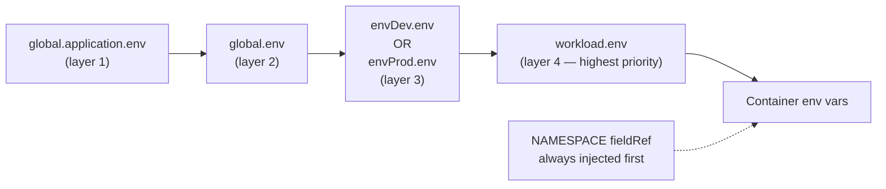
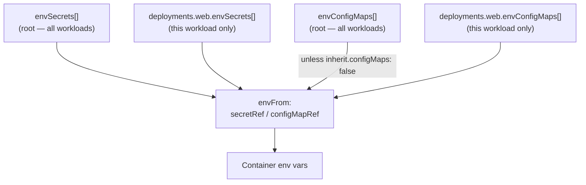

# Environment Variables

## The four-layer merge

Environment variables are merged from four sources in order. Later layers override earlier ones.



> Layer 3 uses `envDev` or `envProd` — only one may be enabled at a time.

### Example

```yaml
global:
  env:
    LOG_LEVEL:
      value: "info"
    APP_ENV:
      value: "production"

deployments:
  api:
    enabled: true
    env:
      LOG_LEVEL:        # overrides global.env
        value: "debug"
      API_PORT:
        value: "8080"
```

Result in the `api` container: `NAMESPACE` (auto), `APP_ENV=production`, `LOG_LEVEL=debug`, `API_PORT=8080`.

---

## Controlling inheritance per workload

Each workload can opt out of individual env layers using `inherit.env`:

| Flag | Controls | Default |
|---|---|---|
| `inherit.env.application` | `global.application.env` | `true` |
| `inherit.env.global` | `global.env` | `true` |
| `inherit.env.dev` | `envDev.env` | `true` |
| `inherit.env.prod` | `envProd.env` | `true` |

```yaml
deployments:
  migration-job:
    enabled: true
    inherit:
      env:
        global: false    # skip global.env for this workload
        dev: false
        prod: false
    env:
      DATABASE_URL:
        value: "postgres://..."
```

Sidecars automatically use the parent workload's `inherit.env` settings.

---

## envDev / envProd

These provide environment-specific variable sets. Exactly one may be `enabled: true` at a time. If both are enabled the chart fails with a validation error.

```yaml
envDev:
  enabled: true
  env:
    API_URL:
      value: "https://dev.api.example.com"
    DEBUG:
      value: "true"

envProd:
  enabled: false
  env:
    API_URL:
      value: "https://api.example.com"
    DEBUG:
      value: "false"
```

---

## envFrom — bulk injection via Secrets and ConfigMaps

In addition to individual `env` entries, you can inject all keys from a Secret or ConfigMap using `envFrom`.



### Root-level injection (all workloads)

```yaml
envSecrets:
  - name: my-app-secret          # injects all keys from this Secret

envConfigMaps:
  - name: my-app-config          # injects all keys from this ConfigMap
  - configMapRef: feature-flags  # shorthand: resolves to <fullname>-feature-flags
```

### Per-workload injection

```yaml
deployments:
  api:
    enabled: true
    envSecrets:
      - name: api-specific-secret
    envConfigMaps:
      - name: api-specific-config
```

### Opting out of root configmaps

```yaml
deployments:
  worker:
    enabled: true
    inherit:
      configMaps: false    # skip root envConfigMaps for this workload
```

### ConfigMapRef shorthand

`{configMapRef: key}` is a shorthand that resolves to `{name: <fullname>-key}` — useful for referencing ConfigMaps created by the chart itself:

```yaml
envConfigMaps:
  - configMapRef: app-settings   # → name: my-release-app-settings
```
