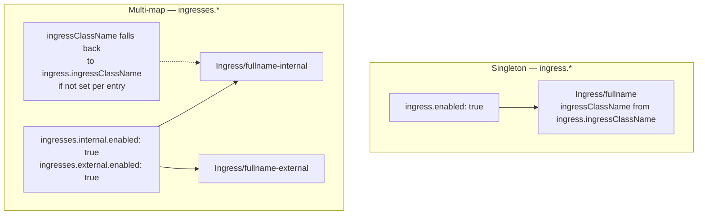
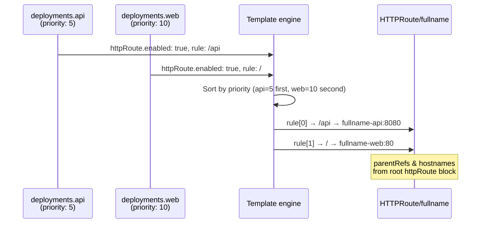
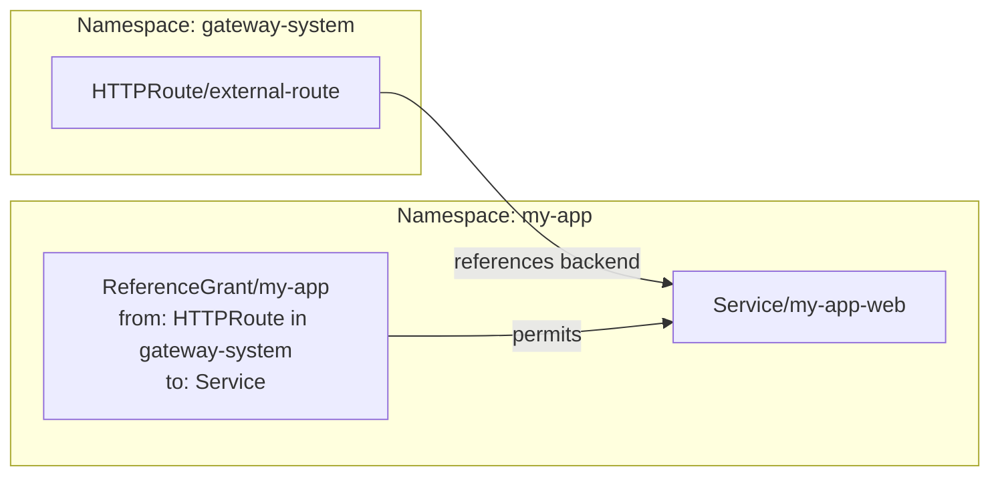

# Ingress & Gateway API

## Ingress



```yaml
ingress:
  enabled: true
  ingressClassName: nginx
  annotations:
    nginx.ingress.kubernetes.io/proxy-body-size: "50m"
  tls:
    - secretName: my-app-tls
      hosts:
        - app.example.com
  hosts:
    - host: app.example.com
      paths:
        - path: /api
          pathType: Prefix
          serviceName: my-release-api   # default: chart fullname
          servicePort: 8080
        - path: /
          pathType: Prefix
          servicePort: 80
```

The `ingresses` map is useful when one release needs different ingress controllers (e.g. internal nginx + external with WAF):

```yaml
ingresses:
  internal:
    enabled: true
    ingressClassName: nginx-internal
    hosts:
      - host: app.internal.example.com
        paths:
          - path: /
            pathType: Prefix
            servicePort: 80
  external:
    enabled: true
    ingressClassName: nginx
    annotations:
      cert-manager.io/cluster-issuer: letsencrypt-prod
    tls:
      - hosts: [app.example.com]
        secretName: app-tls
    hosts:
      - host: app.example.com
        paths:
          - path: /
            pathType: Prefix
            servicePort: 80
```

---

## Gateway API

> **Prerequisites:** Gateway API CRDs must be installed and a compatible Gateway controller must be running (e.g. Cilium, Envoy Gateway, Istio, Traefik, Kong). The Gateway resource itself must be created separately — this chart creates only route resources that attach to an existing Gateway.

### Route types

| Resource | API version | Layer | Default port | Use case |
|---|---|---|---|---|
| `HTTPRoute` | `gateway.networking.k8s.io/v1` | L7 HTTP | 80 | Path/header-based HTTP routing |
| `GRPCRoute` | `gateway.networking.k8s.io/v1` | L7 gRPC | 50051 | gRPC service/method routing |
| `TLSRoute` | `gateway.networking.k8s.io/v1` | L4 TLS | 443 | SNI-based TLS passthrough |
| `ReferenceGrant` | `gateway.networking.k8s.io/v1beta1` | — | — | Cross-namespace backend references |

---

## HTTPRoute

Three patterns are supported, and they can be combined.

### Pattern 1 — Singleton with root-level rules

Creates one `HTTPRoute/<fullname>` with rules defined entirely at root level. Good for single-workload apps.

```yaml
httpRoute:
  enabled: true
  parentRefs:
    - name: my-gateway
      namespace: gateway-system
  hostnames:
    - app.example.com
  rules:
    - matches:
        - path:
            type: PathPrefix
            value: /api
      serviceName: my-release-api   # explicit; default: chart fullname
      servicePort: 8080
    - matches:
        - path:
            type: PathPrefix
            value: /
      serviceName: my-release-web
      servicePort: 80
```

### Pattern 2 — Per-workload merge with priority

Rules from all workloads with `httpRoute.enabled: true` are merged into the singleton `HTTPRoute/<fullname>`.
`parentRefs` and `hostnames` are inherited from the root `httpRoute` block.
`serviceName` defaults to `<fullname>-<workloadName>`; `servicePort` defaults to `service.port`.



```yaml
httpRoute:
  parentRefs:
    - name: my-gateway
      namespace: gateway-system
  hostnames:
    - app.example.com

deployments:
  api:
    service:
      port: 8080
      targetPort: 8080
    httpRoute:
      enabled: true
      priority: 5           # lower = earlier in rules list
      rules:
        - matches:
            - path:
                type: PathPrefix
                value: /api

  web:
    service:
      port: 80
      targetPort: 8080
    httpRoute:
      enabled: true
      priority: 10
      rules:
        - matches:
            - path:
                type: PathPrefix
                value: /
```

Workloads without `priority` are sorted alphabetically after all prioritised workloads.

### Pattern 3 — Multi-map for independent routes

Each entry in `httpRoutes` creates a separate `HTTPRoute/<fullname>-<key>`. Use this when routes need different `parentRefs` or `hostnames`.

```yaml
httpRoutes:
  admin:
    enabled: true
    parentRefs:
      - name: internal-gateway
        namespace: gateway-system
    hostnames:
      - admin.internal.example.com
    rules:
      - serviceName: my-release-admin
        servicePort: 8080
        matches:
          - path:
              type: PathPrefix
              value: /
```

### Using filters (redirect, header modification)

```yaml
httpRoute:
  enabled: true
  rules:
    - matches:
        - path:
            type: PathPrefix
            value: /
      filters:
        - type: RequestRedirect
          requestRedirect:
            scheme: https
            statusCode: 301
      serviceName: my-release-web
      servicePort: 80
```

---

## GRPCRoute

Same patterns as HTTPRoute (singleton, per-workload merge, multi-map). Matches use gRPC service and method names instead of HTTP paths. Default port is `50051`.

```yaml
grpcRoute:
  parentRefs:
    - name: my-gateway
      namespace: gateway-system
  hostnames:
    - grpc.example.com

deployments:
  user-service:
    service:
      port: 50051
      targetPort: 50051
    grpcRoute:
      enabled: true
      priority: 5
      rules:
        - matches:
            - method:
                type: Exact
                service: com.example.UserService
                # method: Login   # optional: omit to match all methods

  order-service:
    service:
      port: 50051
      targetPort: 50051
    grpcRoute:
      enabled: true
      priority: 10
      rules:
        - matches:
            - method:
                type: Exact
                service: com.example.OrderService
```

---

## TLSRoute

Operates at L4 — routes TLS connections based on SNI hostname only. No matches or filters (those are HTTP-level concepts). `hostnames` is required. Default port is `443`.

```yaml
tlsRoute:
  parentRefs:
    - name: my-gateway
      namespace: gateway-system
      sectionName: tls-passthrough   # listener must have mode: Passthrough
  hostnames:
    - secure.example.com             # required; FQDN only (no IPs)

deployments:
  tls-app:
    service:
      port: 8443
      targetPort: 8443
    tlsRoute:
      enabled: true
      rules:
        - {}                         # no matches for TLSRoute; SNI from hostnames above
```

---

## ReferenceGrant

A `ReferenceGrant` is required when an HTTPRoute (or other route) in a **different namespace** needs to reference a Service in this release's namespace.



The `ReferenceGrant` must be created in the **same namespace as the Service** (the release namespace).

```yaml
referenceGrant:
  enabled: true
  from:
    - group: gateway.networking.k8s.io
      kind: HTTPRoute
      namespace: gateway-system      # namespace where the HTTPRoute lives
  to:
    - group: ""
      kind: Service
      # name: my-app-web             # optional: restrict to a specific Service
```

For multiple source namespaces use the map:

```yaml
referenceGrants:
  from-gateway:
    enabled: true
    from:
      - group: gateway.networking.k8s.io
        kind: HTTPRoute
        namespace: gateway-system
    to:
      - group: ""
        kind: Service
  from-other-app:
    enabled: true
    from:
      - group: gateway.networking.k8s.io
        kind: HTTPRoute
        namespace: other-app-ns
    to:
      - group: ""
        kind: Service
        name: my-app-api             # restrict to a single Service
```
