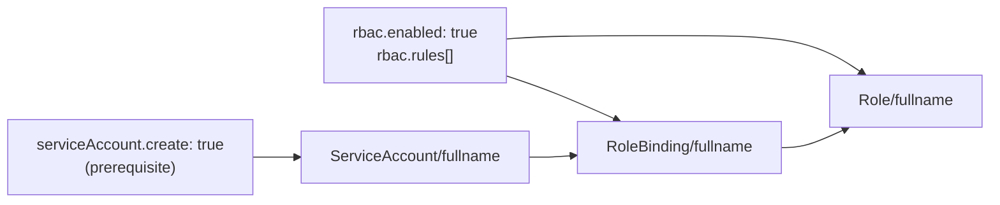

# Operations

## RBAC



```yaml
serviceAccount:
  create: true
  name: ""              # defaults to chart fullname
  annotations:
    eks.amazonaws.com/role-arn: arn:aws:iam::123456789:role/my-app-role

rbac:
  enabled: true
  rules:
    - apiGroups: [""]
      resources: ["configmaps", "secrets"]
      verbs: ["get", "list", "watch"]
    - apiGroups: ["apps"]
      resources: ["deployments"]
      verbs: ["get", "list"]
```

`rbac.enabled` requires `serviceAccount.create: true`.

---

## NetworkPolicy

Defined per workload. By default only `Ingress` traffic is controlled — add `Egress` explicitly if needed.

```yaml
deployments:
  api:
    enabled: true
    networkPolicy:
      enabled: true
      policyTypes:
        - Ingress
        - Egress           # add if you need egress rules
      ingress:
        - from:
            - podSelector:
                matchLabels:
                  app.kubernetes.io/name: web
          ports:
            - protocol: TCP
              port: 8080
      egress:
        - to:
            - namespaceSelector:
                matchLabels:
                  kubernetes.io/metadata.name: database-ns
          ports:
            - protocol: TCP
              port: 5432
```

---

## VictoriaMetrics VMServiceScrape

Requires **both** `service.enabled: true` and `metrics.enabled: true` on the workload.

```yaml
deployments:
  api:
    enabled: true
    service:
      enabled: true
      port: 80
      targetPort: 8080
    metrics:
      enabled: true
      port: "http"                 # named port from service
      path: "/metrics"
      interval: 30s
      scrapeTimeout: 10s
      relabelConfigs:
        - targetLabel: app_name
          replacement: my-api
        - targetLabel: env
          replacement: production
      headers:
        - "Authorization: Bearer $(METRICS_TOKEN)"
      basicAuth:
        username:
          name: metrics-secret
          key: username
        password:
          name: metrics-secret
          key: password
```

| Field | Description |
|---|---|
| `metrics.enabled` | Create a `VMServiceScrape` resource |
| `metrics.port` | Named port to scrape (must match a port name in `service.ports` or `"http"` for single-port) |
| `metrics.path` | Metrics endpoint path (default: `/metrics`) |
| `metrics.interval` | Scrape interval |
| `metrics.scrapeTimeout` | Scrape timeout |
| `metrics.relabelConfigs` | VictoriaMetrics relabel rules |
| `metrics.headers` | Extra HTTP headers for scrape requests |
| `metrics.basicAuth` | HTTP basic auth (references a Secret) |

---

## Troubleshooting

| Symptom | Likely cause | Fix |
|---|---|---|
| `image.repository is required` | No root or per-workload image set | Set `image.repository` and `image.tag` at root or per workload |
| `envDev and envProd cannot both be enabled` | Both `enabled: true` | Set only one to `enabled: true` |
| HPA not created | `keda.enabled: true` on same workload | KEDA takes priority; disable KEDA or use KEDA triggers instead of HPA |
| `maxReplicas is required` | HPA or KEDA enabled without `maxReplicas` | Set `hpa.maxReplicas` or `keda.maxReplicas` |
| ConfigMap not mounted in a workload | `inherit.configMapMount: false` | Check `inherit.configMapMount` setting; set per-configMap to `false` only for that entry |
| ExternalSecret uses `v1beta1` on fresh cluster | Offline render | Run `helm install` against a live cluster with ESO installed |
| Route rules in wrong order | No `priority` set, alphabetical order undesired | Set numeric `priority` on per-workload `httpRoute`/`grpcRoute`/`tlsRoute` |
| Sidecar missing env vars | Sidecar does not inherit parent env by default | Check `inherit.env` on parent workload — sidecars use parent's inherit settings |
| StatefulSet Service has unexpected name | `serviceName` not set | Defaults to `<fullname>-<key>` with `clusterIP: None`; override with `serviceName:` |
