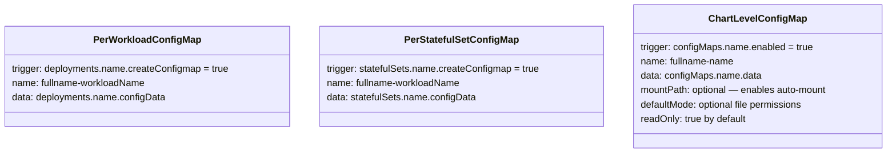
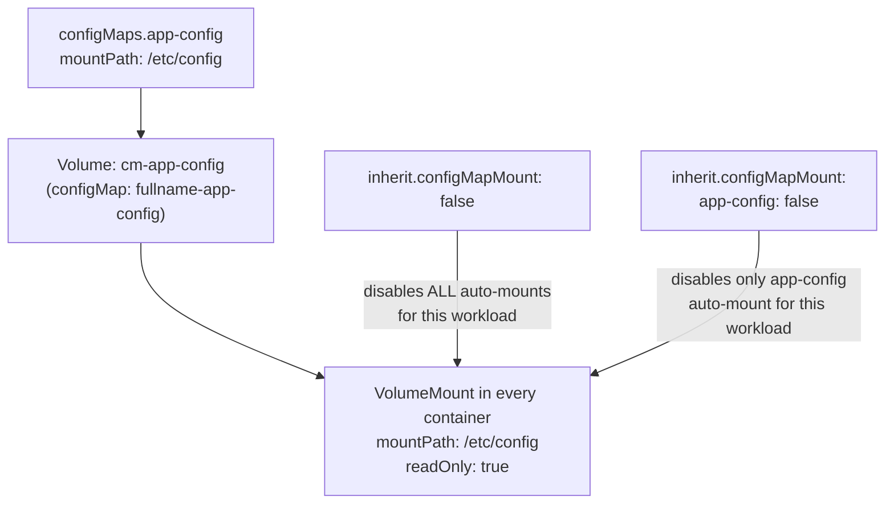
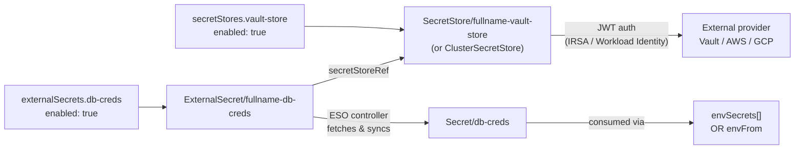

# Secrets & Config

## ConfigMaps

Three types of ConfigMaps are supported:



Prefer **chart-level ConfigMaps** (`configMaps.*`) for new work — they support auto-mount and are the most flexible. Per-workload ConfigMaps (`createConfigmap: true`) exist for backward compatibility.

### Chart-level ConfigMap example

```yaml
configMaps:
  app-config:
    enabled: true
    mountPath: /etc/config       # auto-mount into all containers at this path
    readOnly: true               # default
    data:
      config.json: |
        {"broker": "mqtt://broker:1883", "timeout": 30}
      settings.yaml: |
        log_level: info

  scripts:
    enabled: true
    mountPath: /scripts
    defaultMode: 0755            # make files executable
    data:
      entrypoint.sh: |
        #!/bin/sh
        exec java -jar app.jar

  feature-flags:
    enabled: true
    # no mountPath — use via envConfigMaps (envFrom injection)
    data:
      FEATURE_NEW_UI: "true"
      FEATURE_DARK_MODE: "false"
```

---

## ConfigMap auto-mount

When a chart-level ConfigMap has `mountPath` set, the chart automatically generates a `Volume` and injects a `VolumeMount` into every container of every workload.



```yaml
deployments:
  worker:
    enabled: true
    inherit:
      configMapMount: false       # skip all auto-mounts for this workload

  api:
    enabled: true
    inherit:
      configMapMount:
        scripts: false            # skip only the 'scripts' configMap auto-mount
```

---

## ExternalSecrets Operator (ESO)



### SecretStore — Vault (JWT auth)

```yaml
secretStores:
  vault-store:
    enabled: true
    kind: SecretStore          # or ClusterSecretStore
    provider:
      vault:
        server: https://vault.example.com
        path: secret
        version: v2
        auth:
          jwt:
            mountPath: jwt
            role: my-app-role
            audiences:
              - vault
            expirationSeconds: 600
```

### SecretStore — AWS (IRSA)

```yaml
secretStores:
  aws-store:
    enabled: true
    provider:
      aws:
        service: SecretsManager   # or ParameterStore
        region: us-east-1
        auth:
          jwt:
            audiences:
              - sts.amazonaws.com
```

### SecretStore — GCP (Workload Identity)

```yaml
secretStores:
  gcp-store:
    enabled: true
    provider:
      gcpsm:
        projectID: my-gcp-project
        auth:
          workloadIdentity:
            clusterLocation: us-central1
            clusterName: my-cluster
```

The `serviceAccountRef` defaults to `serviceAccount.name` in all providers.

### ExternalSecret

```yaml
externalSecrets:
  db-creds:
    enabled: true
    secretStore: vault-store     # references secretStores key
    storeKind: SecretStore       # SecretStore | ClusterSecretStore
    refreshInterval: 1h
    targetName: db-creds         # K8s Secret name (default: map key)

    # Fetch individual keys
    data:
      - remoteKey: my-app/db
        secretKey: DB_PASSWORD
        property: password

    # Or fetch entire secret
    dataFrom:
      - remoteKey: my-app/config
```

### data vs dataFrom

| Mode | Values key | When to use |
|---|---|---|
| Individual keys | `data[]` with `remoteRef.property` | Need only a subset of a remote secret's keys |
| Full extract | `dataFrom[]` with `extract` | Need all keys from a remote secret as-is |

### ESO API version auto-detection

The chart detects the installed ESO version via `.Capabilities.APIVersions.Has "external-secrets.io/v1"`:
- ESO ≥ 0.10 → uses `external-secrets.io/v1`
- ESO < 0.10 → uses `external-secrets.io/v1beta1`
- Offline renders (`helm template` without `--kube-version`) → falls back to `v1beta1`
