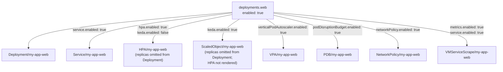
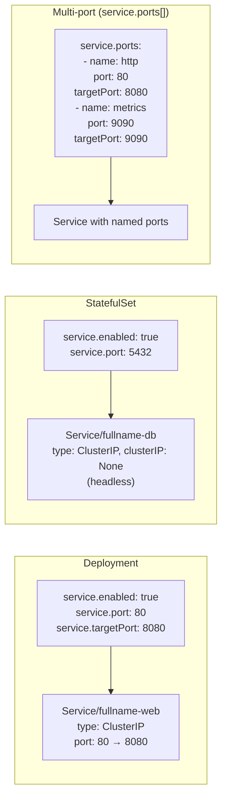

# Workloads

## Deployments

Each key under `deployments` becomes a separate `Deployment` + `Service` (when `service.enabled: true`).



### Key per-workload fields

| Field | Type | Default | Description |
|---|---|---|---|
| `enabled` | bool | — | Required; set `false` to skip rendering |
| `replicaCount` | int | `1` | Ignored when HPA or KEDA is active |
| `image.repository` | string | root `image.repository` | Per-workload image override |
| `image.tag` | string | root `image.tag` | Per-workload tag override |
| `image.pullPolicy` | string | `IfNotPresent` | |
| `command` | string\|list | — | Entrypoint; string runs via `sh -c` |
| `args` | list | — | Container args |
| `env` | map | — | Per-workload env vars (merged on top of global layers) |
| `envSecrets` | list | — | Additional `secretRef` entries in `envFrom` |
| `envConfigMaps` | list | — | Additional `configMapRef` entries in `envFrom` |
| `service.enabled` | bool | `false` | Create a ClusterIP Service |
| `service.port` | int | — | Service port (also used as default `servicePort` in routes) |
| `service.targetPort` | int | — | Container port |
| `service.ports` | list | — | Multi-port alternative to `port`/`targetPort` |
| `probesEnabled` | bool | `false` | Enable readiness/liveness/startup probes |
| `readinessProbe` | object | — | Standard Kubernetes probe spec |
| `livenessProbe` | object | — | Standard Kubernetes probe spec |
| `startupProbe` | object | — | Standard Kubernetes probe spec |
| `resources` | object | — | CPU/memory requests and limits |
| `securityContext` | object | root `securityContext` | Per-workload container security context |
| `podSecurityContext` | object | root `podSecurityContext` | Not overridable per-workload; set at root |
| `automountServiceAccountToken` | bool | `false` | Override per-workload |
| `terminationGracePeriodSeconds` | int | `30` | |
| `minReadySeconds` | int | `0` | |
| `revisionHistoryLimit` | int | `10` | |
| `progressDeadlineSeconds` | int | `600` | Deployments only |
| `strategy` | object | `RollingUpdate` | Deployment update strategy |
| `priorityClassName` | string | root `priorityClassName` | |
| `nodeSelector` | object | root `nodeSelector` | |
| `affinity` | object | root `affinity` | |
| `tolerations` | list | merged with root | |
| `hostAliases` | list | merged with root | |
| `topologySpreadConstraints` | object | root value | |
| `sidecars` | map | — | Additional containers in the pod |
| `volumes` | list | — | Extra volumes |
| `volumeMounts` | list | — | Extra volume mounts |
| `inherit` | object | — | Inheritance control; see [Environment Variables](environment-variables.md) |
| `inheritRootSchedParams` | object | all `true` | Scheduling parameter inheritance |
| `inheritRootHostAliases` | bool | `true` | Include root `hostAliases` |
| `createConfigmap` | bool | `false` | Create a per-workload ConfigMap from `configData` |
| `configData` | map | — | Data for the per-workload ConfigMap |
| `hpa` | object | — | HPA configuration |
| `keda` | object | — | KEDA ScaledObject configuration |
| `verticalPodAutoscaler` | object | root VPA | VPA configuration |
| `podDisruptionBudget` | object | root PDB | PDB configuration |
| `networkPolicy` | object | — | NetworkPolicy configuration |
| `metrics` | object | — | VMServiceScrape configuration |
| `httpRoute` | object | — | Per-workload HTTPRoute (merged into singleton) |
| `grpcRoute` | object | — | Per-workload GRPCRoute (merged into singleton) |
| `tlsRoute` | object | — | Per-workload TLSRoute (merged into singleton) |
| `reloader` | object | root `reloader` | Override Stakater Reloader annotation |

---

## StatefulSets

StatefulSets follow the same structure as Deployments with these differences:

| Aspect | Deployment | StatefulSet |
|---|---|---|
| Service type | ClusterIP | Headless (`clusterIP: None`) |
| Update strategy key | `strategy` | `statefulSetUpdateStrategy` |
| Rolling update params | `maxSurge` / `maxUnavailable` | `partition` |
| `volumeClaimTemplates` | Not supported | Supported |
| HPA | Supported | Not rendered (use KEDA) |
| KEDA | Supported | Supported |

```yaml
statefulSets:
  postgres:
    enabled: true
    image:
      repository: postgres
      tag: "16"
    service:
      enabled: true
      port: 5432
      targetPort: 5432
    volumeClaimTemplates:
      - metadata:
          name: data
        spec:
          accessModes: [ReadWriteOnce]
          resources:
            requests:
              storage: 10Gi
    statefulSetUpdateStrategy:
      type: RollingUpdate
      rollingUpdate:
        partition: 0
```

---

## CronJobs

Each key under `cronJobs` becomes a `batch/v1` CronJob.

| Field | Type | Default | Description |
|---|---|---|---|
| `enabled` | bool | — | Required |
| `schedule` | string | — | Cron expression, e.g. `"0 2 * * *"` |
| `timeZone` | string | — | IANA timezone (Kubernetes ≥ 1.27), e.g. `"Europe/Moscow"` |
| `concurrencyPolicy` | string | `Allow` | `Allow` \| `Forbid` \| `Replace` |
| `successfulJobsHistoryLimit` | int | `3` | |
| `failedJobsHistoryLimit` | int | `1` | |
| `startingDeadlineSeconds` | int | — | |
| `backoffLimit` | int | `2` | |
| `ttlSecondsAfterFinished` | int | `3600` | Auto-delete completed job pods |
| `activeDeadlineSeconds` | int | — | Abort if job exceeds this duration |
| `restartPolicy` | string | `Never` | `Never` \| `OnFailure` |
| `command` | string\|list | — | Job entrypoint |
| `args` | list | — | |
| `env` | map | — | |
| `envSecrets` | list | — | |
| `resources` | object | — | |
| `image` | object | root `image` | Per-CronJob image override |

---

## Services



---

## Sidecars

Sidecars are defined as a map keyed by container name inside a workload. They are sorted alphabetically before rendering.

```yaml
deployments:
  web:
    enabled: true
    service:
      enabled: true
      port: 80
      targetPort: 8080
    sidecars:
      fluent-bit:
        image:
          repository: fluent/fluent-bit
          tag: "3.1"
        args:
          - -c
          - /fluent-bit/etc/fluent-bit.conf
        resources:
          requests:
            cpu: 50m
            memory: 64Mi
        volumeMounts:
          - name: varlog
            mountPath: /var/log
```

**Inheritance rules for sidecars:**

| What | Inherited from parent? |
|---|---|
| `inherit.env.*` flags | Yes — sidecars use parent workload's inherit settings |
| Root `envSecrets` | Yes — injected via `envFrom` |
| Root `envConfigMaps` | Depends on parent's `inherit.configMaps` flag |
| `volumeMounts.<workloadName>` | No — define sidecar mounts locally in `sidecars.<name>.volumeMounts` |
| `inherit.configMapMount` | Yes — auto-mounts follow parent's configMapMount inheritance |

---

## Scheduling

### nodeSelector

Set at root level; applied to all workloads. Per-workload override is not supported — use `affinity` for fine-grained control.

### Affinity, tolerations, and topology spread constraints

Per-workload inheritance is controlled by `inheritRootSchedParams`:

| Flag | Default | Behaviour when `false` |
|---|---|---|
| `inheritRootSchedParams.affinity` | `true` | Use only per-workload `affinity`; root value ignored |
| `inheritRootSchedParams.tolerations` | `true` | Use only per-workload `tolerations`; root not merged |
| `inheritRootSchedParams.tsc` | `true` | Use only per-workload `topologySpreadConstraints` |

```yaml
deployments:
  worker:
    enabled: true
    tolerations:
      - key: dedicated
        operator: Equal
        value: worker
        effect: NoSchedule
    inheritRootSchedParams:
      tolerations: false   # use only the local toleration above
      affinity: true       # still inherit root affinity
```

### topologySpreadConstraints

Disabled by default (`topologySpreadConstraints.enabled: false`) to avoid scheduling failures on single-node clusters.

```yaml
topologySpreadConstraints:
  enabled: true
  constraints:
    - maxSkew: 1
      topologyKey: topology.kubernetes.io/zone
      whenUnsatisfiable: ScheduleAnyway
    - maxSkew: 1
      topologyKey: kubernetes.io/hostname
      whenUnsatisfiable: ScheduleAnyway
```
